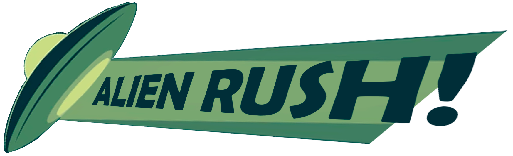

---
# **Alien Rush!**

---

### GRUPO 10: GG TEAM

### **INTEGRANTES**

#### Mario Martín Escribano	 

#### Javier Martín García

#### Daniel Pérez Navarro 

#### Marcos Vivar Muiño

URL de GitHub:
 - https://github.com/MarcosVivarMuino/AlienRush

## 1. ALERTAS DEL JUEGO
En base a las alertas que lanzaba el juego cuando ocurría un conflicto en algunas acciones como en registro de usuarios, de contraseñas... se han añadido botones de mejora de esas alertas que saltaban directamente del propio navegador, para convertirlas en cuadros de diálogo con la temática del juego, de modo que no se pierda la coherencia estética, esas alertas son las siguientes:

### 1.1. CAMPOS VACÍOS
La alerta salta cuando se detecta que algún campo de texto requerido está vacío.

*Ilustración 1: Alertas del juego*

### 1.2. CONFLICTOS DE CONTRASEÑAS
Son alertas que aparecen cuando se detecta algún error en la comprobación de contraseñas, como que la contraseña está mal escrita o que en la verificación las contraseñas escritas no coinciden entre sí.

*Ilustración 2: Alertas de contraseñas*

### 1.3. CONFLICTOS DE USUARIOS
Son alertas que salen cuando ocurre un error en la comprobación de los usuarios, ya sea que un usuario ya está registrado o que simplemente es inválido.

*Ilustración 3: Alertas de usuario*

Cada alerta tendrá un botón para cerrar el cuadro de diálogo mostrado.

*Ilustración 4: Botón de X*

---

## 2 CHAT DEL JUEGO
El chat ha sido mejorado para incentivar su uso por parte de los jugadores, haciéndolo más cómodo y accesible.

## 2.1. CONEXIÓN Y DESCONEXIÓN DE USUARIOS
A partir de ahora, en el chat se mostrará de forma pública qué usuarios se han unido a la sesión o la han abandonado, mandando un mensaje del sistema por el propio chat anunciando la llegada del nuevo jugador a la sala y su posterior salida.

*Ilustración 5: Mejora de chat de juego*

### 2.2. TECLA INTRO PARA EL CHAT
La tecla intro, que anteriormente estaba bloqueada por su uso en el juego, ahora se puede utilizar para enviar mensajes en el chat, siendo esta una vía más accesible y cómoda para el jugador a diferencia de tener que hacer clic encima del botón.

---

## 3. PUNTUACIÓN EN EL JUEGO
Ahora, cuando alguno de los jugadores abduce cualquier humano, vaca u objeto, se verá la puntuación que suma ese ítem justo encima de donde se encontraba el ítem que se acaba de abducir, de forma que el jugador oueda ver con claridad cuánto suma cada ítem o cuanto daño le puede hacer.

*Ilustración 6: Puntuación en el juego*

## PLATAFORMAS EN LAS QUE ENCONTRAR EL JUEGO
Alien Rush ha sido subido a varias plataformas de juegos online, de tal forma que sea un juego público en red en perfecto funcionamiento que todos los usurios puedan probar y disfrutar.
Esas plataformas son:

### GAME JOLT
https://gamejolt.com/games/AlienRush/967041

### ITCH.IO
https://gg-team.itch.io/alien-rush

### NEW GROUNDS
https://www.newgrounds.com/portal/view/965374

### INDIEDB
https://www.indiedb.com/games/alienrush/downloads/alienrush
