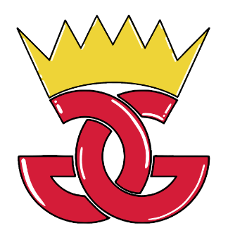

---
# **Alien Rush!**

---

### GRUPO 10: GG TEAM

### **INTEGRANTES**

#### Mario Martín Escribano	 

#### Javier Martín García

#### Daniel Pérez Navarro 

#### Marcos Vivar Muiño

## ALERTAS DEL JUEGO
En base a las alertas que lanzaba el juego cuando ocurría un conflicto en algunas acciones como en registro de usuarios, de contraseñas... se han añadido botones de mejora de esas alertas que saltaban directamente del propio navegador, para convertirlas en cuadros de diálogo con la temática del juego, de modo que no se pierda la coherencia estética, esas alertas son las siguientes:

### CAMPOS VACÍOS
La alerta salta cuando se detecta que algún campo de texto requerido está vacío.

*Ilustración 1: Alertas del juego*

### CONFLICTOS DE CONTRASEÑAS
Son alertas que aparecen cuando se detecta algún error en la comprobación de contraseñas, como que la contraseña está mal escrita o que en la verificación las contraseñas escritas no coinciden entre sí.

*Ilustración 2: Alertas de contraseñas*

### CONFLICTOS DE USUARIOS
Son alertas que salen cuando ocurre un error en la comprobación de los usuarios, ya sea que un usuario ya está registrado o que simplemente es inválido.

*Ilustración 3: Alertas de usuario*

Cada alerta tendrá un botón para cerrar el cuadro de diálogo mostrado.

*Ilustración 4: Botón de X*