

---
# **Alien Rush!**

---

### GRUPO 10: GG TEAM
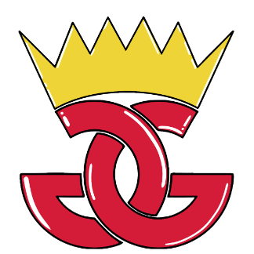
### **INTEGRANTES**

#### Mario Martín Escribano	 

#### Javier Martín García

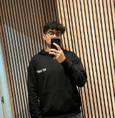

#### Daniel Pérez Navarro 

#### Marcos Vivar Muiño

---
## **ÍNDICE**
[**INTEGRANTES DEL EQUIPO**](#_z0rh9dzfrvj3)

[**CONCEPTOS DEL JUEGO**](#_rswfds54woh)

[1. NOMBRE DEL JUEGO Y DESCRIPCIÓN](#_kyz1vo4wggnz)

[2. HISTORIA	7](#_wt7dt2kgyo7g)

[3. DESCRIPCIÓN DE LA TEMÁTICA DEL JUEGO](#_16u9vsgr9djr)

[4. PÚBLICO OBJETIVO](#_od1dnss0a0mw)

[**ASPECTO TÉCNICO DEL JUEGO**](#_v3mlhxbq6d2)

[1. CONDICIONES DE VICTORIA Y DERROTA](#_4we2zljfae7t)

[2. MECÁNICAS](#_ox1n7mdz8l68)

[2.1. BÁSICAS](#_80u3u6etpek)

[2.2. POTENCIADORES](#_ig5two63km2o)

[**DISEÑOS Y CONCEPT-ARTS**](#_ipcbhvuykbdn)

[1. PERSONAJES](#_wdmtdubkpk0m)

[1.1. PERSONAJES HUMANOS](#_a9lqf8fpogrj)

[1.2. PERSONAJES VACAS](#_23ov1ras98cn)

[1.3. CHATARRA](#_4rsemzwoct82)

[1.4. MILITAR](#_owkp6x4oowal)

[1.5. PERSONAJES HUMANOS CON ESTEROIDES](#_v1gmtfbu50b7)

[2. NAVE](#_hnluayo0zj7t)

[3. ESCENARIOS](#_ofghojrc3ozq)

[4. LOGO DEL JUEGO](#_8xpebftqo7pc)

[5. MENÚ DE INICIO](#_olfolzwqujl1)

[6. INTERFAZ DE VICTORIA Y DERROTA](#_4zagq7yyoirj)

[**MÚSICA Y SONIDOS**](#_atpo95cjn57p)

[**FLUJOGRAMA**](#_n409q3vvp6wr)

# 

---
# **INTEGRANTES DEL EQUIPO**
**Daniel Pérez Navarro**

- Correo oficial: <d.perezn.2021@alumnos.urjc.es>
- Cuenta GitHub: dperezn2021

**Mario Martin Escribano**

- Correo oficial: m.martine.2021@alumnos.urjc.es
- Cuenta GitHub: mariome22

**Javier Martín García**

- Correo oficial: j.martinga.2021@alumnos.urjc.es
- Cuenta GitHub: mjaavi

**Marcos Vivar Muiño**

- Correo oficial: m.vivar.2021@alumnos.urjc.es
- Cuenta GitHub: MarcosVivarMuiño

# 

---
# **CONCEPTOS DEL JUEGO**
## **1. NOMBRE DEL JUEGO Y DESCRIPCIÓN**
El nombre del juego es “***Alien Rush!*”**, sería un juego estilo “matatopos” arcade, en el que los jugadores compiten en un mismo escenario por abducir al máximo número de terrestres posibles en el tiempo especificado, gana el jugador que más terrestres haya abducido. Los jugadores deben tener cuidado a la hora de elegir sus objetivos, ya que algunos serán perjudiciales para la sociedad alien, al igual que algunos darán poderosos beneficios a la hora de enfrentarse a su eterno rival alienígena. El juego cuenta con una vista cenital que ayuda al jugador a observar todo el mapa directamente, sin necesidad de mover la cámara.
## **2. HISTORIA**
Círculos en campos de maíz, extrañas desapariciones humanas y vacunas, misteriosas luces en los cielos… Signos de una eterna guerra interplanetaria por la obtención del recurso más valioso… HUMANOS FRESCOS y LLENOS DE ENERGÍA, que mejor fuente de recursos que 70 kilos de carbohidratos y vitaminas, listos para ser recolectados cuales rábanos del huerto. Sin embargo, ninguna de las civilizaciones del cosmos está dispuesta a compartir estos deliciosos rollitos de vitaminas con el resto, por lo que habrá que competir por este escaso recurso.
## **3. DESCRIPCIÓN DE LA TEMÁTICA DEL JUEGO**
Un juego estilo Cartoon animado y ciencia ficción, en el que naves de diferentes civilizaciones extraterrestres compiten entre sí por ver quien es capaz de conseguir el máximo número de seres terrestres. Los objetivos de dicha abducción pueden ser de gran variedad de tipos:

- **Humanos**: La unidad básica de vida terranea, son importantes pero no mucho. Dan una puntuación media.
- **Vacas**: La cúspide de la evolución terranea, la más importante figura en la sociedad extraterrestre. Da una puntuación alta.
- **“Bomba”**: ¿A quién se le ocurre dejar bombas tiradas por ahí?, no conviene absorber una de ellas, las consecuencias podrían ser catastróficas. Restan una vida.
- **Humano con esteroides**: No confundir con asteroides. Un humano mejorado genéticamente que puede ofrecer poderosos beneficios a la nave. Dan un potenciador aleatorio.
- **Militar**: A pesar de no ser más que ovejitas que pastan por su mundo, los humanos han conseguido desarrollar ciertos instintos de supervivencia y fruto de dichos instintos nacieron los militares. Colar uno en tu nave puede ser desastroso para la misión. Se pierde automáticamente.
## **4. PÚBLICO OBJETIVO**
El juego estaría enfocado a aquellos jugadores que buscan entretenimiento rápido y sencillo. Al no requerir grandes cantidades de tiempo ni esfuerzo, ***Alien Rush!*** se postula como una gran opción para aquellos jugadores que quieren pasar el tiempo entre viajes o relajarse de la rutina diaria con un pasatiempo casual.

---
# **ASPECTO TÉCNICO DEL JUEGO**
## **1. CONDICIONES DE VICTORIA Y DERROTA**
Existirán diversas condiciones de victoria y derrota que amenizarán el juego y darán variedad a la hora de desarrollar diferentes partidas, entre estas condiciones estarán:

- Cada partida tendrá un tiempo estimado de 2 minutos, al final del tiempo de juego, el jugador que haya obtenido más abducciones ganará la partida.
- Las naves tendrán un medidor de vida de 5 puntos y existirán objetos que si se abducen, restarán vida a la nave del jugador, de esta forma si alguno de los jugadores deja su nave sin vida, perderá la partida instantáneamente por no poder continuar.
## **2. MECÁNICAS**
### **2.1. BÁSICAS**
El juego consistirá en abducir al mayor número de personas posibles, intentando obtener una puntuación superior a la del rival al final de la partida. De esta forma, el juego tratará de mover una nave a lo largo de un mapa, interactuando con las personas y objetos que aparecen por él para abducirlos, pudiendo ser objetos de puntuación, potenciadores u objetos que producen daño a la nave, por lo que las mecánicas quedan resumidas en:

- Movimiento: movimiento libre de la nave por el tablero para buscar personas.
- Abducción: es la mecánica necesaria para conseguir puntos y ganar la partida.
- Utilización de potenciadores: objetos que ayudan al jugador en el transcurso de la partida.
### 	**2.2. POTENCIADORES**
Se introducen diferentes potenciadores que ayuden al jugador en el transcurso de la partida, pudiendo ser objetos que potencien las habilidades del jugador o que se puedan utilizar para perjudicar el progreso del otro jugador, algunos de estos potenciadores son:	

- Movimiento rápido: El jugador tendrá una mejora de velocidad que permitirá moverse más rápido por el tablero, pudiendo llegar a los objetivos antes que su rival.
- Multiplicador de puntos: La abducción de personas sumará el doble de puntuación que de normal durante un periodo corto de tiempo.
- Aumentador de capacidad: El rango de abducción aumenta, provocando la posibilidad de abducir a más personas a la vez.
- Bloqueador: Objeto que se podrá utilizar en contra del rival, para bloquear su movimiento durante unos segundos.
- Ralentizador: Se aplicará sobre el rival, limitando su velocidad de movimiento durante unos segundos.

## **3. CONTROLES EN LOCAL Y EN RED**

El juego se puede jugar tanto en local, con ambos jugadores en un mismo dispositivo , como en red, donde cada jugador competirá desde su propio dispositivo.

Los controles principalmente serán para moverse en las 4 direcciones posibles (arriba, abajo, izquierda y derecha), para poder utilizar la función de abducir y para poder utilizar los potenciadores.

El juego funcionará principalmente mediante el uso del teclado tanto en local como en red, en primer lugar, los controles de juego en local serán:

Jugador 1: Las teclas “W”, “A”, “S” y “D” para el movimiento por el tablero, la tecla “ESPACIO” para abducir y la tecla “E” para la utilización del potenciador.

- Jugador 2: Las teclas “I”, “J”, “K” y “L” para el movimiento por el tablero, la tecla de “INTRO” para abducir y la tecla “O” para la utilización del potenciador.

En segundo lugar, en el juego en red los controles serán los mismos que utiliza el jugador 1 en el juego local, ya que son con los que más se familiarizan los jugadores, por lo que estos serán:

Las teclas “W”, “A”, “S” y “D” para el movimiento por el tablero, la tecla “ESPACIO” para abducir y la tecla “E” para la utilización del potenciador.

---
# **DISEÑOS Y CONCEPT-ARTS**
## **1. PERSONAJES ABDUCIBLES**
Habrá diferentes tipos de personajes y elementos que poder abducir. Cada uno de ellos tienen desempeñan acciones y resultados diferentes al obtenerlos.
### **1.1. PERSONAJES HUMANOS** 
**Descripción**: Los humanos comunes y corrientes que son el objetivo principal de las abducciones.

**Puntos**: +1 punto por cada humano abducido.

**Apariencia**: Deberían verse como personas comunes desde una vista cenital, tal vez con diferentes atuendos cotidianos (camisas, pantalones, vestidos).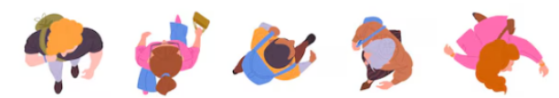

*Ilustración 1: Idea de humanos normales*

### **1.2. PERSONAJES VACAS**
**Descripción**: Estos animales son especialmente codiciados, otorgando el doble de puntos que los humanos.

**Puntos**: +2 puntos por cada vaca abducida.

**Apariencia**: Vacas de gran tamaño visibles desde la vista cenital, con manchas negras y blancas típicas.

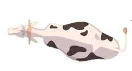

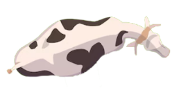

*Ilustración 2: Idea de vacas*

### **1.3. CHATARRA**
**Descripción**: Objetos de metal o basura que, en lugar de ser útiles, causan daño a la nave alienígena.

**Efecto**: -1 punto de vida a la nave alienígena.

**Apariencia**: Trozos de chatarra como coches rotos, electrodomésticos viejos o restos metálicos.

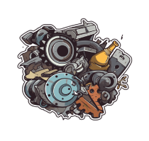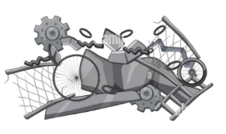

*Ilustración 3: Idea de chatarra*

### **1.4. MILITAR**
**Descripción**: Personajes militares que son un peligro mortal. Si los abduces por error, pierdes inmediatamente.

**Efecto**: Pérdida instantánea de la partida.

**Apariencia**: Soldados o militares con uniformes, cascos y armas, fácilmente 
reconocibles desde la vista cenital.

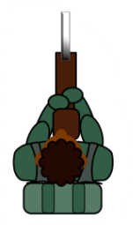

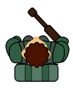

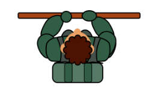

*Ilustración 4: Idea de militares*
### **1.5. PERSONAJES HUMANOS CON ESTEROIDES**
**Descripción**: Humanos más grandes y fuertes que otorgan un aumento temporal en las habilidades de la nave alienígena.

**Efecto**: Aumentan las habilidades de tu nave o disminuye las del rival (como más velocidad de movimiento, duplicidad de puntos en un tiempo determinado…).

**Apariencia**: Humanos musculosos, con una apariencia más robusta o exagerada en comparación con los humanos normales, para que se distingan fácilmente.

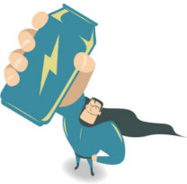

*Ilustración 5: Idea de humano con esteroides*
## **2. NAVE**
Como personaje jugable tendrá cada jugador un OVNI con un marciano, que será el que deberemos controlar para poder abducir a los ya nombrados anteriormente.

La idea es que sea una vista cenital donde se aprecie justo debajo la zona habilitada para poder abducir a los terrestres.

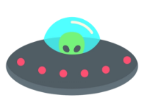

*Ilustración 6: Idea de nave*

## **3. ESCENARIOS**
En **Alien Rush!** podrás escoger en qué mapa juegas contando con 3 distintos, antes de empezar la partida se podrá elegir el escenario:

### **3.1. NIVEL 1: Granja**

Para la granja, se escogerá un mapa en el que podremos ver elementos como tractores, campos de cultivo, un granero o incluso establos. Algo de este estilo:

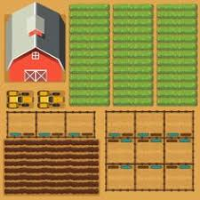

*Ilustración 7: Idea de mapa - Granja*

Finalmente se ha diseñado un fondo que actúe como escenario del videojuego, de tal forma que contenga elementos simples que hagan ver que el escenario es un simple añadido visual, que no afecte a la vista de los humanos y demás personajes.

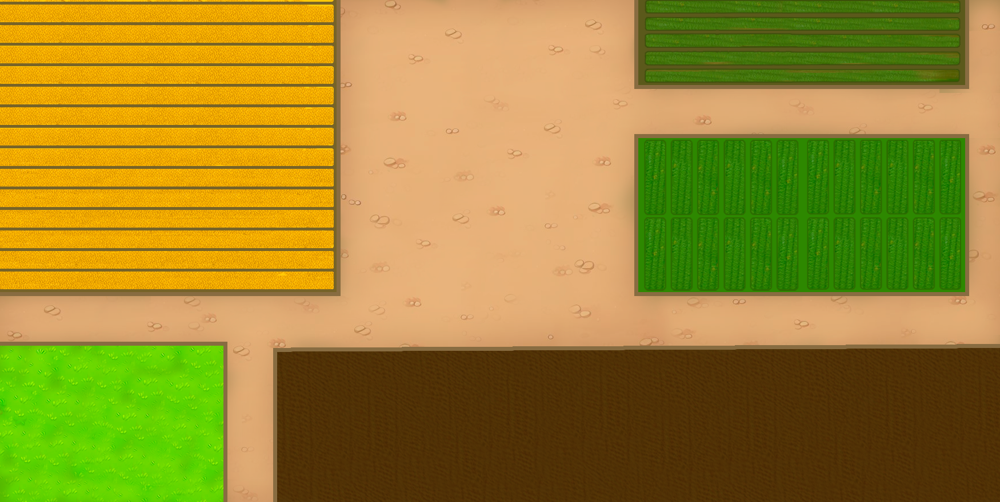

*Ilustración 8: Escenario de granja*

### **3.2. Nivel 2:  Ciudad**

En el nivel de la ciudad, será algo parecido a la siguiente imagen, un escenario que represente una pequeña ciudad donde se representan elementos visuales que puedan servir en ella como coches, carreteras o edificios. 

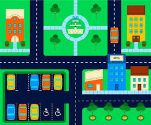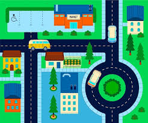

*Ilustración 9: Idea de mapa - Ciudad*

Al igual que con la granja, también se ha diseñado un fondo de una ciudad que actúa como escenario visual del juego, en el que los personajes sean claramente distinguibles y guarde coherencia con el estilo.

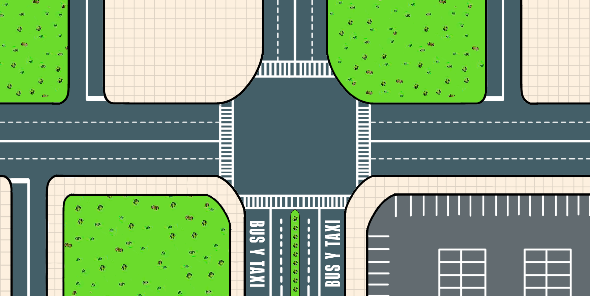

*Ilustración 10: Escenario de ciudad*

### **3.3. Nivel 3:  Playa**

Para la playa, será como las siguientes imágenes, un lugar donde se aprecian sombrillas, hamacas o barcos.
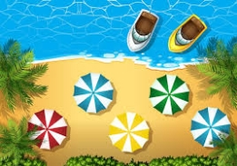
*Ilustración 11: Idea de mapa - Playa*
## 

## **4. LOGO DEL JUEGO**

![ref2]

*Ilustración 12: Logo horizontal*

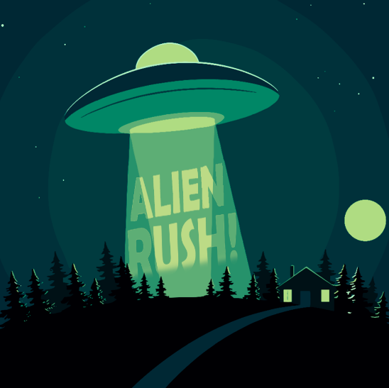

*Ilustración 13: Logo vertical*

## **5. MENÚ DE INICIO**
Esta pantalla incluirá el logo del juego y tres botones adicionales, desde los cuáles podremos jugar, ir a las opciones y acceder a los créditos, que incluirán la información de todos los participantes del proyecto.
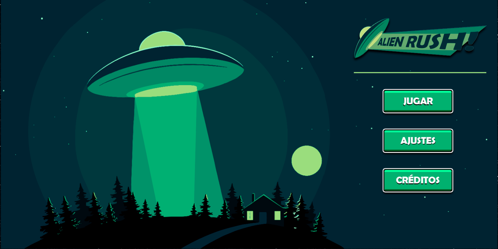
*Ilustración 14: Pantalla de inicio*

## **6. INTERFAZ DE VICTORIA Y DERROTA**
Un mensaje de victoria en la pantalla del ganador en la que se especifique los puntos obtenidos y el motivo de victoria.

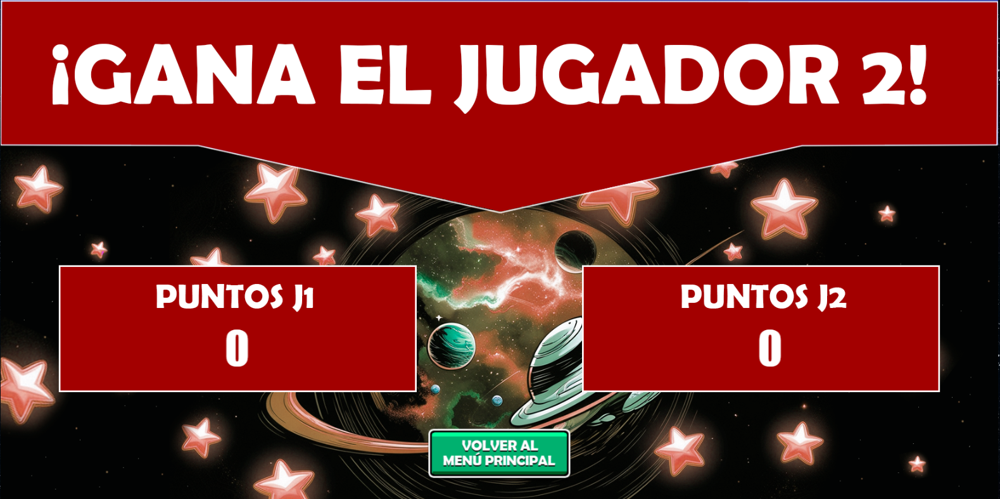
*Ilustración 15: Pantalla de victoria*

Un mensaje de derrota en la pantalla del perdedor en la que se especifique los puntos obtenidos y el motivo de la derrota.

## **7. MENÚS**
Se han diseñado las interfaces básicas necesarias para el desarrollo normal del videojuego, que incluyen algunas de las siguientes pantallas:

### **7.2. PANTALLA DE AJUSTES**

*Ilustración 16: Pantalla de ajustes*

### **7.3. PANTALLA DE CREDITOS**
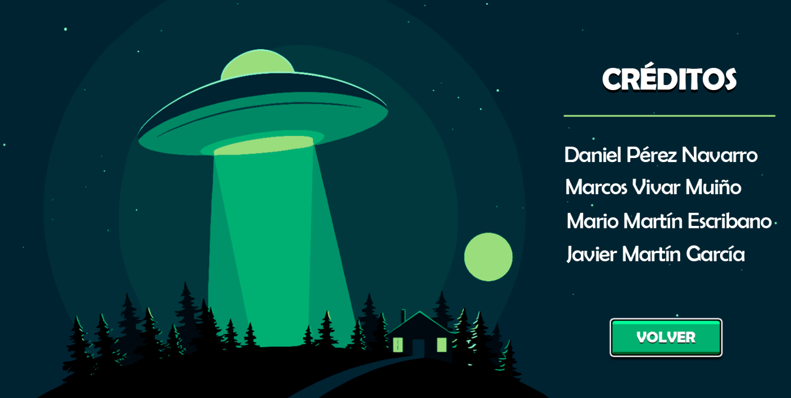
*Ilustración 17: Pantalla de créditos*

### **7.4. PANTALLA DE ELECCIÓN DE MAPA**
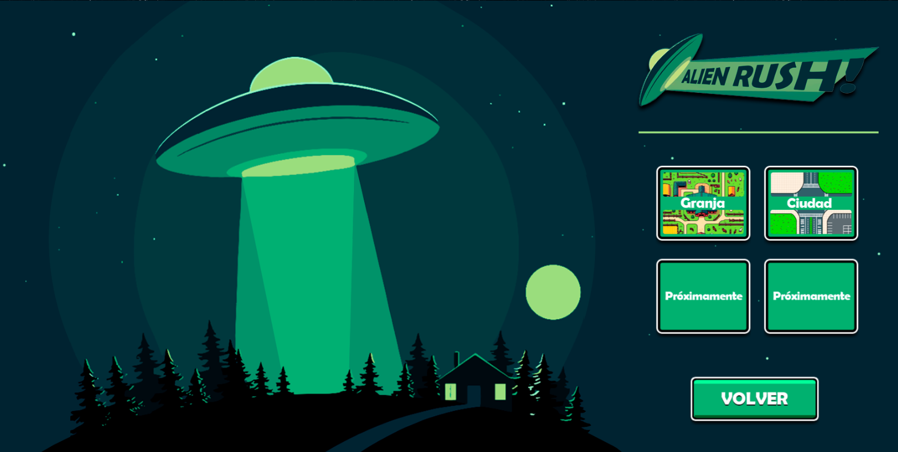
*Ilustración 18: Pantalla de elección de mapa*

#### **8. EJEMPLOS DE PARTIDA**
Aquí se mostrarán las pantallas que muestren los ejemplos de como se verían las partidas del juego final.

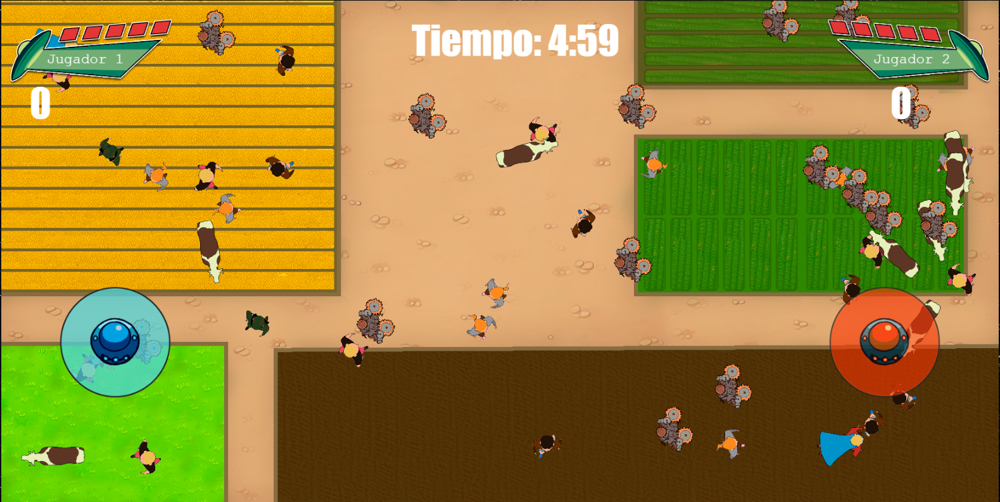
*Ilustración 19: Ejemplo de partida*

Además se ha diseñado una pequeña interfaz para el tutorial del juego.

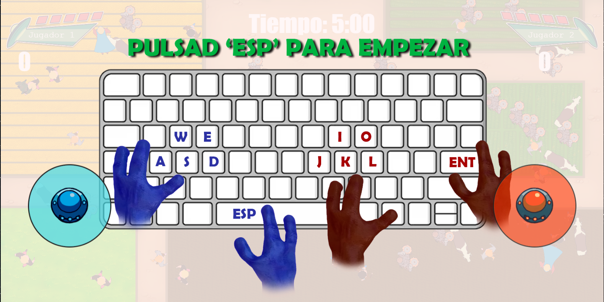
*Ilustración 20: Pantalla de tutorial*

## **9. POTENCIADORES**
Se han realizado los diseños finales que tendrán los potenciadores de cara al juego final, estos diseños son:

### **9.1. MULTIPLICADOR DE VELOCIDAD**

*Ilustración 21: Multiplicador de velocidad*

### **9.2. MULTIPLICADOR DE PUNTOS**

*Ilustración 22: Multiplicador de puntos*

### **9.3. AUMENTO DE CAPACIDAD**
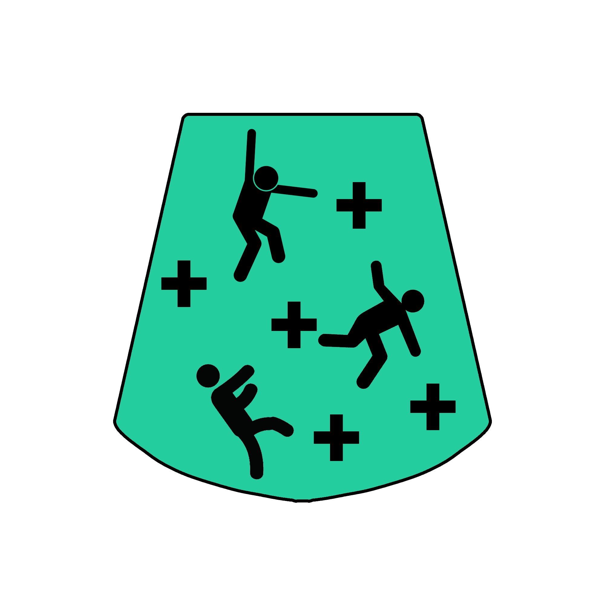
*Ilustración 23: Aumento de capacidad*

### **9.4. BLOQUEADOR**
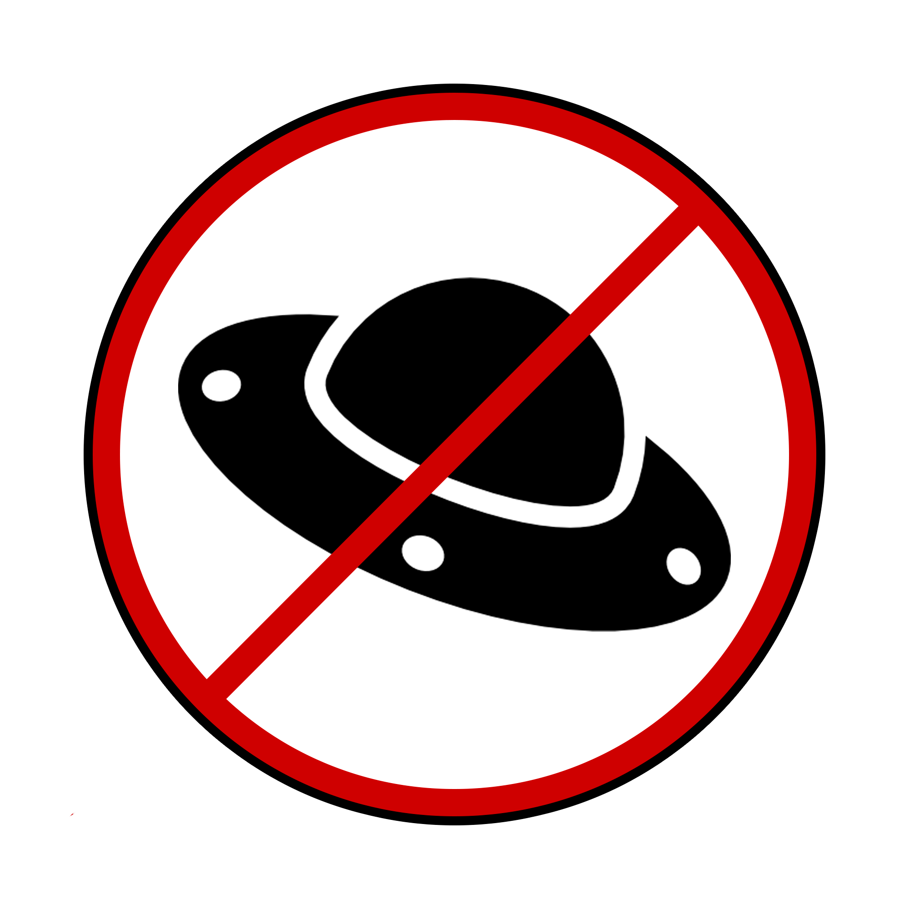
*Ilustración 24: Bloqueador*

### **9.5. RALENTIZADOR**

*Ilustración 25: Ralentizador*

## **10. PERSONAJES FINALES**
Aquí se muestran los personajes y objetos abducibles del juego en su versión final, es decir, la que permanecerá desde ya en el juego.

### **10.1. JUGADORES**
Para los jugadores se ha decidido realizar el diseño de una nave que será de color diferente para cada jugador.
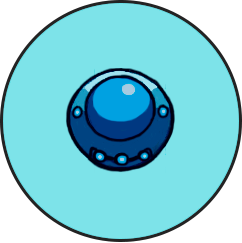
*Ilustración 26: Player 1*

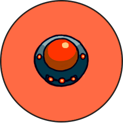
*Ilustración 27: Player 2*

### **10.2. HUMANOS**
Existen diferentes tipos de humanos que pueden ser abducidos como ya se ha explicado.

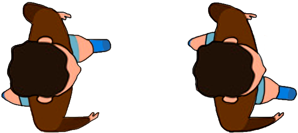
*Ilustración 28: Humano normal*

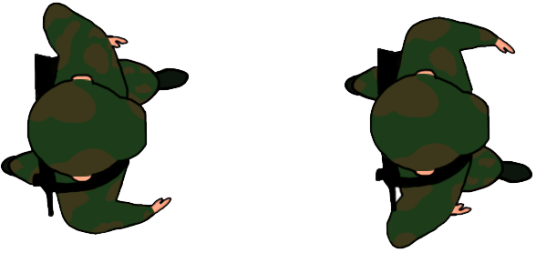
*Ilustración 29: Militar*

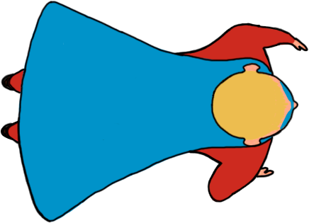
*Ilustración 30: Superheroe*

### **10.3. OTROS ABDUCIBLES**
Aquí los diseños de otros objetos u animales abducibles como la chatarra y las vacas.

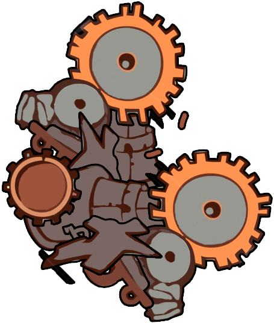
*Ilustración 31: Chatarra*

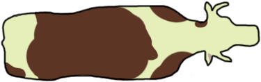
*Ilustración 32: Vaca*

---
# **MÚSICA Y SONIDOS**
“***Alien Rush***!” contará con músicas de fondo tanto en el menú como en la propia partida, con la intención de no hacer aburrida la escena ni el recorrido entre las diferentes pantallas.

Además, contará con efectos de sonido para expresar diferentes acciones. Algunos ejemplos son:

- Sonidos para cuando pierde una vida la nave
- Sonidos para cuando abduces personajes del mapa

---
# **FLUJOGRAMA**

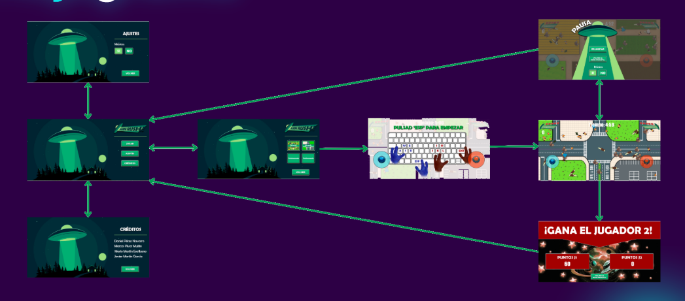

*Ilustración 33: Flujograma*

[ref1]: IMAGENES/Aspose.Words.fa9ba589-423c-453e-9d00-5d9b19b066f3.002.png
[ref2]: IMAGENES/Aspose.Words.fa9ba589-423c-453e-9d00-5d9b19b066f3.022.png
